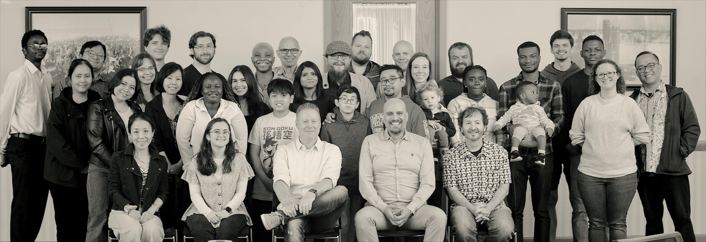
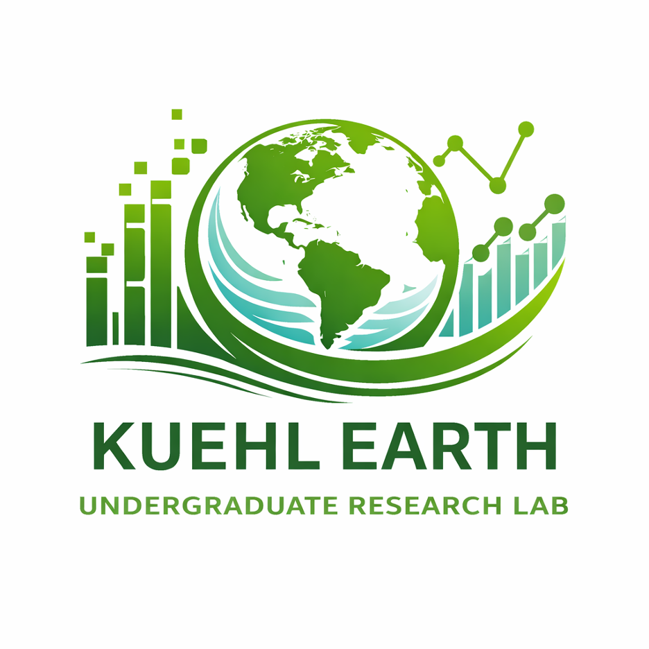
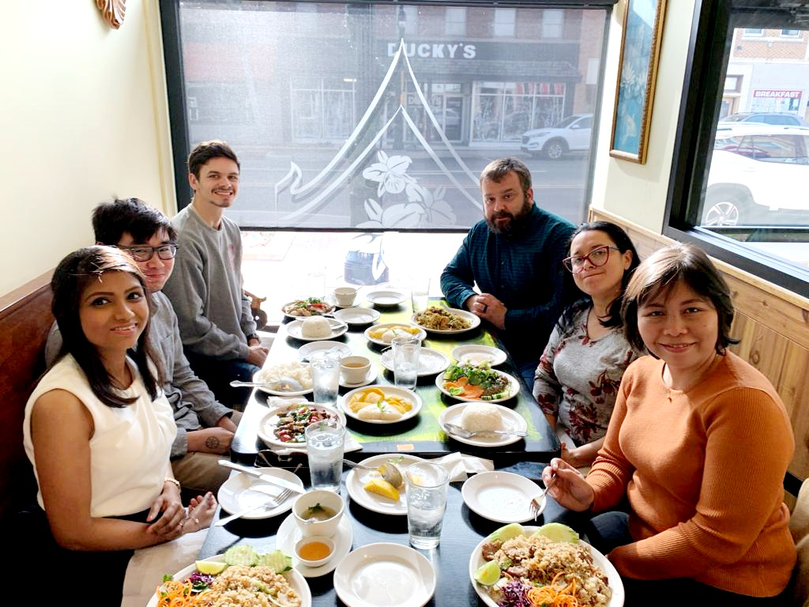
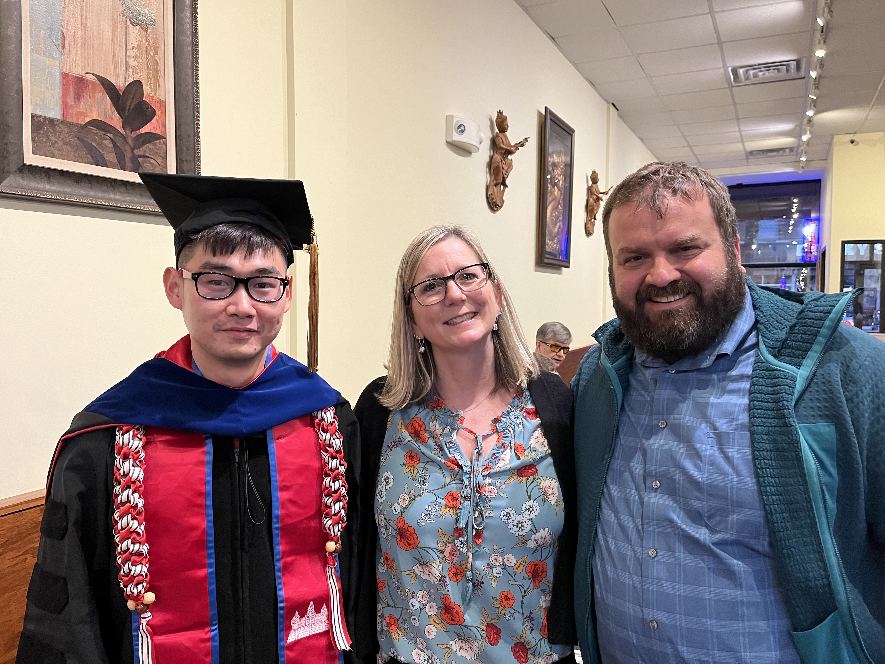
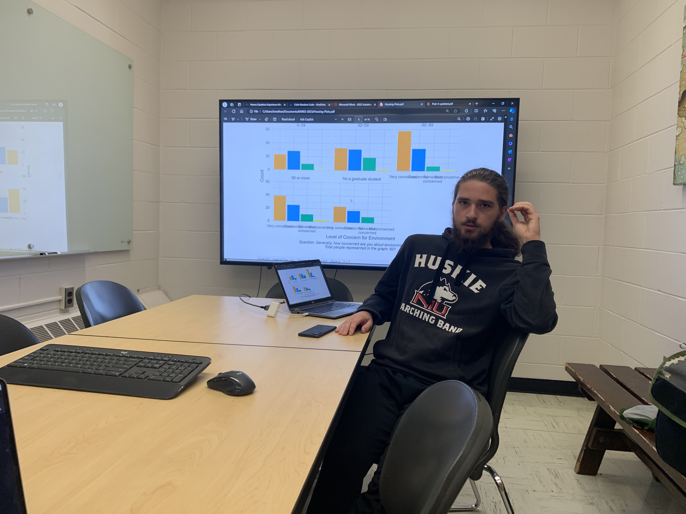
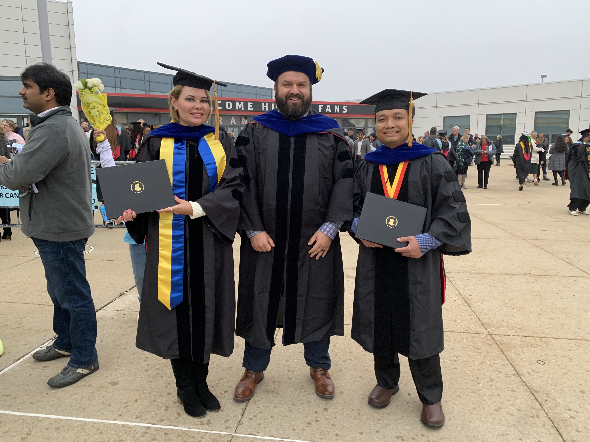

## MA and PhD Supervision
The [Political Science department at NIU](https://www.niu.edu/clas/polisci/academics/graduate/index.shtml) has a long and prestigious tradition of Masters and PhD level graduate training. Our students go onto successful careers in academia, public service, etc all over the world. 

I am particularly interested in working with students focused on global environmental issues, including those from Southeast Asia and the rest of the developing world. Please get in touch prior to applying if you have interest in joining our program or working directly with me as a supervisor. 

----

## Undergraduate Research

Most semesters I oversee an undergraduate research lab. This is a group of three to five undergraduates working on various environmental policy research projects. Despite the corny name, the Kuehl Earth Lab endeavors to take on ambitious empirical research focused on using the tools of social science to improve the natural environment. I am always looking for motivated undergraduate students interested in contributing. If you are interested in joining, as either a research assistant or independent researcher, please email or stop by office hours. 

::: {layout-ncol=4 layout-valign="top"}

:::
